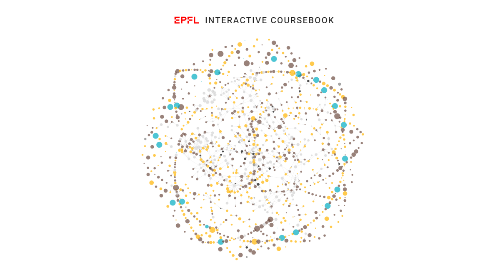

<p align="center"><a href="http://epfl.space"></a></p>

:iphone: [App](http://epfl.space)

:movie_camera: [Screencast](https://youtu.be/FY7176yZnPM)

The EPFL Interactive Coursebook is a Progressive Web App (PWA). You can add it to your home screen like a native application and even use it offline, on your mobile and desktop.

**Browse EPFL courses on a graph...**


**...or from a list**


### Debugging production build locally
Run a production build:

```bash
npm run build
```

Serve the production build directory ([see here](https://cli.vuejs.org/guide/deployment.html#previewing-locally)):

```bash
npm install -g serve
serve -s dist
```

To see how the PWA appears on mobile, follow [these instructions](https://developers.google.com/web/tools/chrome-devtools/remote-debugging).

### Contribute
Please [contact](mailto:valentin.loftsson@epfl.ch;michael.spierer@epfl.ch;michal.pleskowicz@epfl.ch) us if you would like to contribute

### Authors
+ Valentin Oliver Loftsson
+ Michal Piotr Pleskowicz
+ Michaël Spierer
