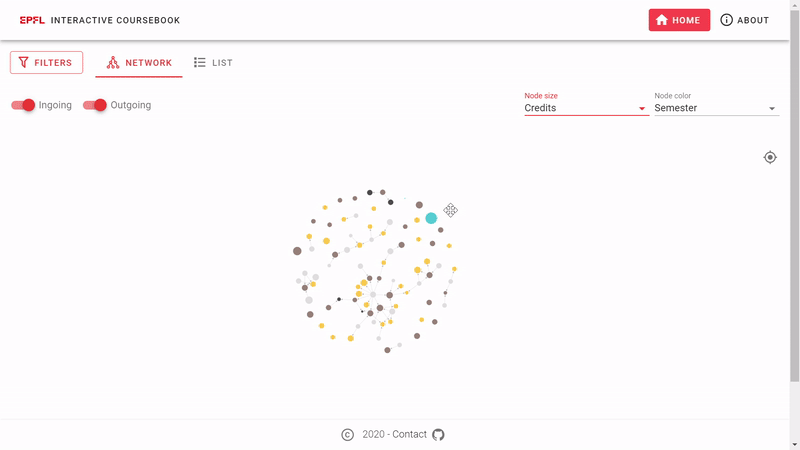
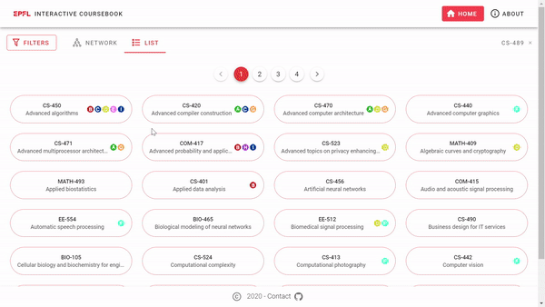

# EPFL Interactive Coursebook
## Project of Data Visualization (COM-480)

[**VIEW THE APP**](http://epfl.space)

[**VIEW THE SCREENCAST**](https://youtu.be/FY7176yZnPM)

[**READ THE PROCESS BOOK**](process-book.pdf)

**Browse courses on a graph!**



**...or from a list!**



## Milestone 1 (Friday 3rd April, 5pm)
[Read here](milestone1.md)

## Milestone 2 (Friday 1st May, 5pm)
[Read here](milestone2.pdf)

## Milestone 3 (Thursday 28th May, 5pm)
[Read here](process-book.pdf)

## Repo structure

    ├── public              # static files for web app
    ├── python              # python notebooks for data pre-processing, wrangling and analysis
    ├── src                 # source code for web app


## Data
You can find the data on [Google Drive](https://drive.google.com/file/d/1nTmosly1uZh_QjDW_yg-4B1QVKLlhSJR/view?usp=sharing)

## Local setup and development
The project requires [NPM](https://npmjs.com/)

Installs all modules
```
npm install
```

Compiles and hot-reloads for development
```
npm run serve
```

Compiles and minifies for production
```
npm run build
```

Lints and fixes files
```
npm run lint
```

Note that in development mode, you need to have the `master.json` data file in the `public/` directory

## Authors

| Student's name | SCIPER |
| -------------- | ------ |
| [Valentin Oliver Loftsson](valentin.loftsson@epfl.ch) | 308099 |
| [Michaël Spierer](michael.spierer@epfl.ch) | 236503 |
| [Michal Piotr Pleskowicz](michal.pleskowicz@epfl.ch) | 251034 |
