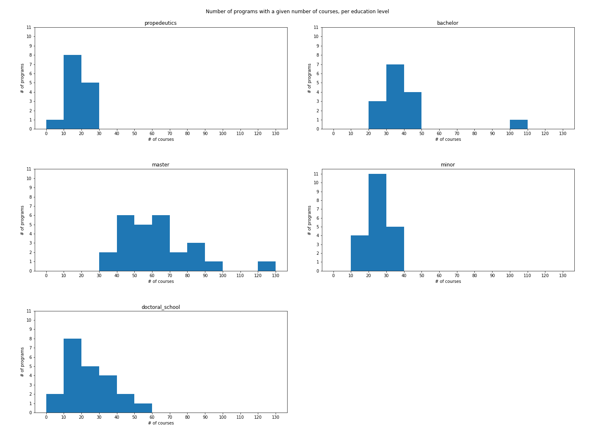
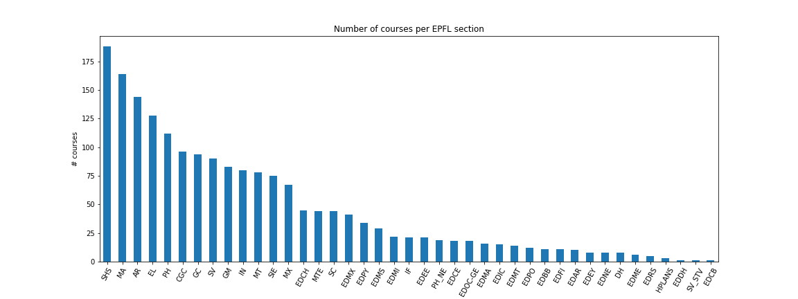

## Milestone 1
The purpose of this milestone is to set up goals for our final project and assess the feasibility of our ideas. We begin by introducing the dataset we will be working with, the data source, format and features. Next, we frame the general topic of our visualization and discuss the motivation behind the project and its significance to the target audience. We share the data pre-processing steps required and display some basic results and statistics. Finally, we discuss related work, originality and sources of inspiration.

### Dataset
We have at our disposal the set of all EPFL programs, courses and course registrations. We harvested course data from EPFL [studyplans](https://edu.epfl.ch/studyplan/en) and [coursebooks](https://edu.epfl.ch/coursebook/en/data-visualization-COM-480), and course registrations were gathered from the [IS-Academia Reporting portal](https://isa.epfl.ch/imoniteur_ISAP/!gedreports.htm). Hence, we can assume that the data collected are of good quality since they have been scraped from official EPFL sources. You are free to [contact us](mailto:valentin.loftsson@epfl.ch;michael.spierer@epfl.ch;michal.pleskowicz@epfl.ch) if you have any questions about the data and the methods used in gathering it.

After some pre-processing steps, the raw data has been thoughtfully transformed and organized into _three_ `.json` files (see [Exploratory Data Analysis](#exploratory-data-analysis) section below).

[View data previews](preview.md#data-previews)

* [`epfl_courses.json`](preview.md#courses) contains detailed information about every course, with course codes as keys.
* [`epfl_programs.json`](preview.md#programs) contains all programs at EPFL and the list of course codes for each program.
* [`epfl_master_specs.json`](preview.md#specializations) contains information about specializations of master's programs which offer them. For each program, it lists the specializations for each course and vice versa.

We are still going to need to do some cleaning to fix a few inconsistencies discovered in `epfl_courses.json`. Also, we have not yet processed data for course registrations and course dependencies. This and other processing left-overs you can find out about in our [goals for the next milestone](#goals-for-next-milestone).

### Problematic
If you are a student at EPFL, you know that sometimes it can be hard to pick suitable courses for the upcoming semester. If you are a teacher at EPFL, you might be familiar with the challenge of understanding what other teachers are teaching your students and how it relates to the content in your course or which courses teach similar or related concepts. You might have browsed through the different study plans and course books and opened multiple tabs on your web browser in order to make sense of the highly interconnected system of knowledge that is being presented in a fragmented way.

In this project, we aim to visualize the courses currently taught at EPFL and the relationships between them. Since we want to visualize relationships, the data will be represented on a network graph. The courses themselves will be represented by the nodes of the graph and dependencies between courses as (directed) edges. Different node colors, shapes and sizes will be used to distinguish nodes. For instance, the number of registered students could determine the node size. We envision both an impressive visualization and a rich interactive tool with options for searching and filtering. The user should be able to filter by level, section, program, specialization, course name or code. This can come in handy in many instances, for example when students want to see only the courses of their own program. When filters are applied, nodes in the immediate neighbourhood that don't fulfill the filter condition are displayed in a neutral color. When hovering over or selecting a node, information is displayed about the course.

We also aim to provide a complementary data analysis summary on a separate page in the form of a data story, with plots and textual descriptions.

### Exploratory Data Analysis

_Number of programs per academic level_

| level        |   propedeutics |   bachelor |   master |   minor |   doctoral_school |
|:-------------|---------------:|-----------:|---------:|--------:|------------------:|
| num_programs |             14 |         15 |       26 |      20 |                22 |

_Credit number distribution of courses_

| credits     |   0 |   1 |   2 |   3 |   4 |   5 |   6 |   7 |   8 |   9 |   10 |   12 |   13 |   14 |   20 |   22 |   30 |
|:------------|----:|----:|----:|----:|----:|----:|----:|----:|----:|----:|-----:|-----:|-----:|-----:|-----:|-----:|-----:|
| num_courses |  18 | 117 | 373 | 420 | 464 | 199 | 126 |  22 |  34 |   4 |   36 |    9 |   20 |    2 |   10 |    2 |   29 |

_Distribution of the number of courses per academic program: Histogram for each education level_

_Exam form distribution of courses_

| exam_form   |   During the semester |   Written |   Oral |   Multiple |   Oral presentation |   Project report |   Term paper |   Written & Oral |   None |   Autre (reprise) |
|:------------|----------------------:|----------:|-------:|-----------:|--------------------:|-----------------:|-------------:|-----------------:|-------:|------------------:|
| num_courses |                   691 |       625 |    325 |         65 |                  64 |               54 |           38 |               18 |      4 |                 1 |

_Number of lecturers distribution of courses_

| num_lecturers |   0 |    1 |   2 |   3 |   4 |   5 |   6 |   7 |   8 |   9 |
|:--------------|----:|-----:|----:|----:|----:|----:|----:|----:|----:|----:|
| num_courses   | 234 | 1117 | 331 | 137 |  43 |  15 |   4 |   1 |   2 |   1 |

_Language distribution of courses_

| language    |   English |   French |   French and English |   German |
|:------------|----------:|---------:|---------------------:|---------:|
| num_courses |      1177 |      648 |                   58 |        2 |

_Number of courses per EPFL section_

### Related work
In this project we attempt to provide a visual overview of the deep well of teaching expertise at EPFL. With the originality of the data set aside, we have not found any work that attempts to visualize EPFL courses in any way. The data is original because we harvested the data from different sources, integrated the structures innovatively, and pre-processed and formatted them to suit the visualization task. Of course, we are aware that the data is not complete and some links will be missing in the graph, since the edges will be based only on the stated course dependencies of course book authors. Our main goal is not to simply analyze the data and present insights in tables and graphs, rather we want to create a useful tool ─ _the ultimate interactive course book for EPFL_.

These graph examples have provided us with inspiration:
* [Force-Directed Graph](https://observablehq.com/@d3/force-directed-graph) (inspiration: distinct colors, drag-around graph)
* [Disjoint Force-Directed Graph](https://observablehq.com/@d3/disjoint-force-directed-graph) (inspiration: taking the nature of disjoint graphs into account)
* [Drag & Zoom](https://observablehq.com/@d3/drag-zoom?collection=@d3/d3-drag) (inspiration: drag & zoom functionality)
* [HiTech Companies Graph](https://www.anychart.com/products/anychart/gallery/Network_Graph/Knowledge_Graph.php) (inspiration: drag without moving other nodes, node and edge hover state)

### Goals for next milestone
* ~~Process and integrate course registration data into `epfl_courses.json`.~~
* ~~Process the fields `required`, `recommended`, `concepts` and `prerequisite_for` in `epfl_courses.json` to discover dependencies between courses and create an adjacency list. This list will be stored in a separate `.json` file(s).~~
* ~~Fix the few inconsistencies discovered when processing `epfl_courses`. There are very few exceptions that will require manual overview, and we will handle them before the next milestone.~~
* ~~Make sketches and design core visualization.~~
* ~~Create an API to query the data.~~
